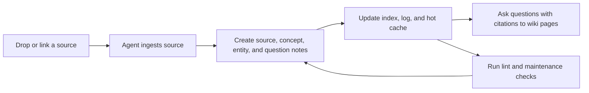

# claude-obsidian

`claude-obsidian` is an open-source maintenance system for building a persistent Markdown knowledge base with Codex and Obsidian.

The project turns a vault into a reusable Codex workspace: sources are ingested into linked notes, sessions preserve recent context, and lint passes keep the wiki healthy.

This public repository ships the mechanism only: skills, commands, templates, setup scripts, tests, and seed examples. It does not ship private vault contents, personal logs, client material, finance files, source imports, or generated user outputs.

## Why It Exists

Most AI note workflows stop at chat over existing notes. `claude-obsidian` focuses on maintenance:

- Create wiki pages from source material.
- Keep concepts, entities, sources, questions, and logs connected.
- Preserve recent context between sessions with a hot cache.
- Run lint and review workflows over the vault.
- Keep the workflow small enough for maintainers to inspect, test, and extend.
- Keep everything in plain Markdown that the maintainer owns.

## What Ships

```text
claude-obsidian/
|-- skills/                 # Agent Skills for wiki setup, ingest, query, lint, and save
|-- commands/               # Slash-command entrypoints
|-- agents/                 # Optional worker instructions for ingest and lint
|-- scripts/                # DragonScale helpers and maintenance scripts
|-- tests/                  # Regression tests for shipped helper scripts
|-- _templates/             # Obsidian note templates
|-- wiki/                   # Seed wiki examples and public documentation pages
`-- docs/                   # Installation, release, privacy, and maintainer docs
```

Private working vault folders such as inboxes, logs, life notes, client work, sources, and generated outputs are intentionally excluded from the public package.

## Core Workflow



## Core Skills

| Skill | Purpose |
|---|---|
| `wiki` | Bootstrap or continue a structured Obsidian wiki. |
| `wiki-ingest` | Convert sources into linked Markdown notes. |
| `wiki-query` | Answer questions from the local wiki with citations. |
| `wiki-lint` | Find orphans, dead links, stale pages, and missing structure. |
| `save` | File useful conversations as wiki notes. |

## Optional DragonScale Layer

DragonScale is an optional advanced layer for maintainers who need stronger vault maintenance:

1. Fold operator: extractive log rollups.
2. Deterministic page addresses: stable `c-NNNNNN` IDs.
3. Semantic tiling lint: embedding-based duplicate-page review.

DragonScale is opt-in. The base wiki workflow remains the public core.

## Installation

Clone the repository and run the setup script:

```bash
git clone https://github.com/AgriciDaniel/claude-obsidian
cd claude-obsidian
bash bin/setup-vault.sh
```

Open the folder as an Obsidian vault, then start Codex in the same folder and run `/wiki`.

For Codex skill discovery, symlink the skills directory:

```bash
ln -s "$(pwd)/skills" ~/.codex/skills/claude-obsidian
```

## Privacy Boundary

This repository is designed to be a reusable mechanism, not a published copy of a person's working vault.

Public:

- skills
- commands
- templates
- setup scripts
- tests
- seed docs
- mechanism documentation

Private:

- personal notes
- conversation logs
- source imports
- client work
- finance data
- daily records
- generated outputs
- local workflow artifacts

See [docs/privacy-boundary.md](docs/privacy-boundary.md) for the full boundary.

## Maintainer Use Cases

- Review and improve wiki-ingest behavior.
- Triage issues about Obsidian compatibility.
- Run release checks for DragonScale helper scripts.
- Use Codex for PR review, docs updates, regression testing, and release workflows.

## License

MIT. See [LICENSE](LICENSE).
