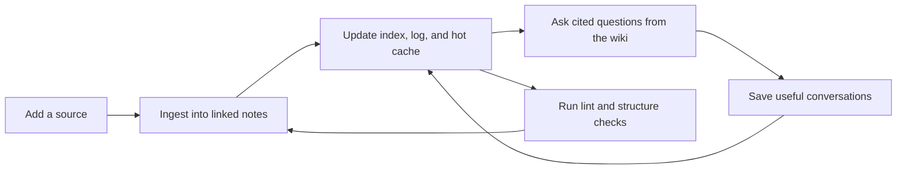

# Compound Vault

Compound Vault is an open-source maintenance layer for agent-maintained Markdown knowledge bases.

It turns an Obsidian vault into a durable workspace that Codex can keep improving: ingest sources, file linked wiki pages, preserve working context, answer from local notes with citations, and lint the vault before knowledge decays.

The repository currently lives at `AgriciDaniel/claude-obsidian` for continuity, but the system is not Claude-specific. The public surface is Codex + Obsidian, plain Markdown, and small inspectable scripts.

## What Makes It Different

Most AI note tools stop at search or chat. Compound Vault focuses on maintenance.

| Common pattern | Compound Vault |
|---|---|
| Chat with a folder of notes | Maintain a linked wiki that improves after each session |
| Store memory in a black-box index | Keep memory as plain Markdown the maintainer can inspect |
| Summarize a source once | Split sources into source, concept, entity, question, and log notes |
| Rely on prompt history | Preserve durable context through index, log, hot cache, and optional folds |
| Treat retrieval as the whole product | Pair retrieval with lint, structure repair, and release-safe workflows |
| Mix private vault data into the repo | Ship only reusable mechanisms, templates, tests, and seed examples |

The unique bet is simple: an AI knowledge base should be a maintained artifact, not a chat transcript and not only a vector index.

## What It Is

Compound Vault is a scaffold for building a compounding local wiki:

- **A Codex skill package** for wiki setup, ingestion, query, lint, and conversation saving.
- **An Obsidian-compatible vault structure** with reusable templates and seed examples.
- **A maintenance loop** that keeps sources, concepts, entities, questions, logs, and indexes connected.
- **A privacy boundary** that separates public mechanisms from private vault contents.
- **A testable toolchain** for scripts, retrieval helpers, address allocation, and lint workflows.
- **An optional DragonScale layer** for larger vaults that need rollups, stable page addresses, and duplicate-page review.

It is not a hosted note app, a private vault dump, or a generic RAG demo. It is a local-first mechanism for letting Codex work on a Markdown knowledge base over time.

## Core Loop



Each pass leaves the vault in a better state for the next pass. That is the "compound" in Compound Vault.

## Core Skills

| Skill | Purpose |
|---|---|
| `wiki` | Bootstrap or continue a structured Obsidian wiki. |
| `wiki-ingest` | Convert sources into linked Markdown notes. |
| `wiki-query` | Answer questions from the local wiki with citations. |
| `wiki-lint` | Find orphans, dead links, stale pages, and missing structure. |
| `save` | File useful conversations as durable wiki notes. |

## What Ships

```text
compound-vault/
|-- skills/                 # Codex skills for setup, ingest, query, lint, and save
|-- commands/               # Slash-command entrypoints
|-- agents/                 # Optional worker instructions for ingest and lint
|-- scripts/                # Retrieval, lint, and DragonScale helper scripts
|-- tests/                  # Regression tests for shipped helper scripts
|-- _templates/             # Obsidian note templates
|-- wiki/                   # Seed wiki examples and public documentation pages
`-- docs/                   # Installation, architecture, privacy, and release documentation
```

Private working vault folders such as inboxes, logs, life notes, client work, sources, and generated outputs are intentionally excluded from the public package.

## Optional DragonScale Layer

DragonScale is the advanced layer for maintainers who need stronger large-vault mechanics:

1. Extractive fold rollups for long-running logs.
2. Deterministic page addresses such as `c-NNNNNN`.
3. Semantic tiling lint for duplicate or overlapping pages.
4. Boundary-first topic suggestion for research loops.

DragonScale is opt-in. The base system remains wiki setup, ingest, query, lint, and save.

## Installation

Clone the repository and run the setup script:

```bash
git clone https://github.com/AgriciDaniel/claude-obsidian
cd claude-obsidian
bash bin/setup-vault.sh
```

Open the folder as an Obsidian vault, then start Codex in the same folder and run `/wiki`.

For Codex skill discovery, symlink the skills directory:

```bash
ln -s "$(pwd)/skills" ~/.codex/skills/compound-vault
```

If you are keeping compatibility with an existing install that already uses the old slug, the symlink target can also remain `~/.codex/skills/claude-obsidian`.

## Privacy Boundary

Compound Vault is published as a mechanism, not as a copy of a person's working vault.

Public:

- skills
- commands
- templates
- setup scripts
- tests
- seed docs
- mechanism documentation

Private:

- personal notes
- conversation logs
- source imports
- client work
- finance data
- daily records
- generated outputs
- local workflow artifacts

See [docs/privacy-boundary.md](docs/privacy-boundary.md) for the full boundary.

## Maintainer Use Cases

- Review and improve wiki-ingest behavior.
- Triage issues about Obsidian compatibility.
- Harden retrieval, lint, and local-first privacy boundaries.
- Run release checks for DragonScale helper scripts.
- Use Codex for PR review, docs updates, regression testing, and safe automation.

## License

MIT. See [LICENSE](LICENSE).
