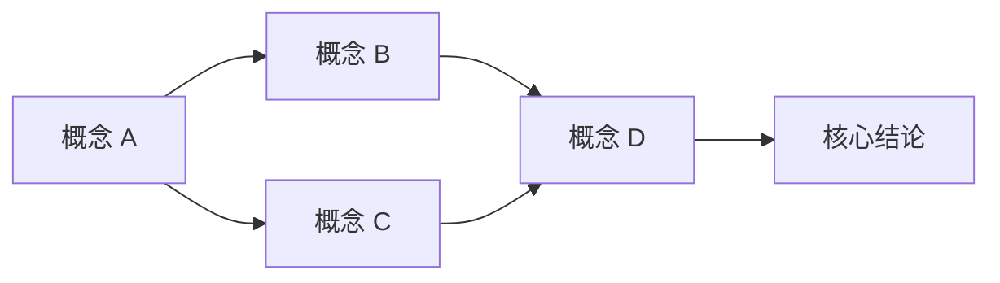

# `= this.source_title`

> [!abstract] 一句话定位
> [20 字以内概括：这篇文章的核心价值或结论]

---

## 先说结论

[这篇文章值不值得读？为什么？适合什么场景下的什么人看？]

- **可读性**：★☆☆☆☆ (1-5)
- **信息密度**：★☆☆☆☆ (1-5)
- **新颖度**：★☆☆☆☆ (1-5)
- **适合**：[目标读者]
- **不适合**：[什么人不值得花时间]

---

## 目录地图

[按什么顺序读这篇文章更容易懂。如果文章本身有内部结构（如章节），按结构说明；如果是非线性文章，建议一条阅读路径。]

1. **先读** [哪个部分] — [理由]
2. **再读** [哪个部分] — [理由]
3. **精读** [哪个部分] — [理由]
4. **可跳读** [哪个部分] — [理由]

---

## 像人讲一遍

[不是百科条目。用自然中文、像跟朋友聊天一样把文章的核心逻辑讲一遍。允许口语化、允许个人语气。不要堆概念，不要翻译腔。]

> 这段是给人读的，不是给机器读的。写完后自己读一遍：像人话吗？

---

## 上游与下游

### 前置知识

理解这篇文章需要先知道什么？

- <!-- 概念名 --> — [为什么需要知道这个]
- <!-- 概念名 -->

### 延伸方向

读完这篇文章可以继续往哪走？

- <!-- 概念名 --> — [延伸方向说明]
- <!-- 概念名 -->

### 与已有知识的关系

这篇文章和我已经知道的东西有什么关联、冲突或印证？

- ⇄ <!-- 概念名 --> [印证/补充]
- ⇄ <!-- 概念名 --> [冲突/不同视角]
- ⇄ <!-- 概念名 --> [延伸/拓展]

---

## 关键概念怎么连起来

[这篇文章里的核心概念之间是什么关系？画一张图谱。]

[如果不上图，文字描述也可以：概念 X 是 Y 的前置条件，Y 与 Z 互为反例，等等。]

---

## 值得沉淀的 wiki 页面

### Source（来源证据）

- <!-- 概念名 --> — source summary 页面

### Concept（核心概念）

- <!-- 概念名 -->
- <!-- 概念名 -->

### Entity（关键人物/工具/公司）

- <!-- 概念名 -->
- <!-- 概念名 -->

### Connection（交叉比较）

- <!-- 概念名 --> — [有的话]

---

## 待补知识 / 红链候选

以下概念在文章中提及但暂时没有独立页面。**红链数量就是知识缺口量**。

- <!-- 概念名 --> (高优先级) — [为什么值得独立成页]
- <!-- 概念名 --> (中优先级) — [为什么值得独立成页]
- <!-- 概念名 --> (低优先级) — [可以等以后再说]

> 红链越多说明这篇文章带来新概念的密度越高，但也意味着本知识库在这块的积累越薄 — 是好事也是信号。

---

## 后续可问的问题

从这篇文章延伸出来的开放问题（暂未回答）：

1. ? —
2. ? —
3. ? —

---

## 以后怎么查回来

[当只记得模糊印象时，通过什么线索能找回这篇文章？]

- **关键词**：
- **领域标签**：#source #article-home
- **相关的已有页面**：[[index]]
- **可能的回忆片段**：[写下你以后最可能记得的一句话或一个细节]

---

## 人类判断区

> [!note] AI 不自动替代人的价值判断
> 以下空格是为人类预留的 — 这篇文章对你个人来说到底有什么价值？AI 的综合能力很强，但"这篇对我意味着什么"只有你能判断。

### 这篇文章对我有什么用？

### 我需要反驳或质疑文章里的哪个观点？

### 接下来我打算做什么？
