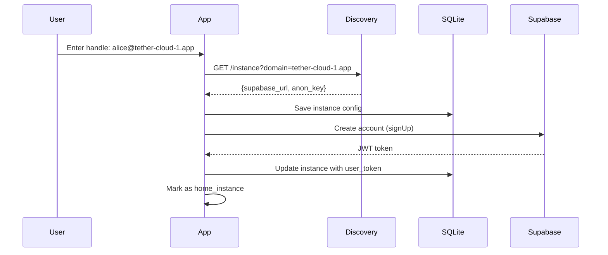
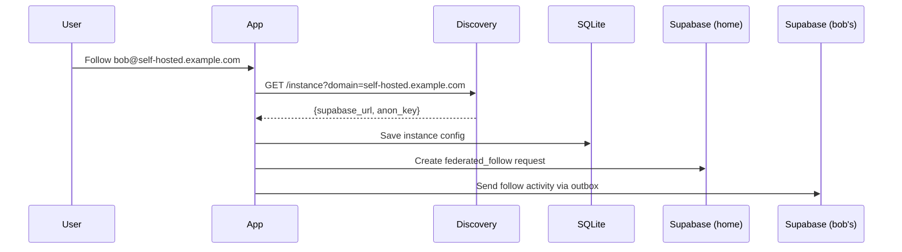

# Multi-Instance Configuration Architecture

## Overview

Tether uses a federated architecture where users can connect to multiple Supabase instances:
- **Official "Tether Cloud" instances** (managed by project)
- **Self-hosted instances** (run by communities/families)
- **Enterprise instances** (private deployments)

**User Handle Format:** `alice@tether-cloud-1.app`

---

## Architecture Decision: Runtime Discovery

**Chosen Approach:** Auto-discovery via central discovery service

**User Flow:**
1. User enters handle: `alice@tether-cloud-1.app`
2. App queries: `https://discovery.tether.app/api/instance?domain=tether-cloud-1.app`
3. Discovery returns instance config (Supabase URL + anon key)
4. App stores config locally after successful auth

---

## Components

### 1. Discovery Service

**Endpoint:** `https://discovery.tether.app/api/instance`

**Request:**
```http
GET /api/instance?domain=tether-cloud-1.app
```

**Response:**
```json
{
  "domain": "tether-cloud-1.app",
  "supabase_url": "https://xxx.supabase.co",
  "supabase_anon_key": "eyJhbG...",
  "federation_enabled": true,
  "version": "1.0.0",
  "max_circle_size": 50,
  "features": ["trips", "achievements", "social"]
}
```

**Registration Endpoint** (for self-hosters):
```http
POST /api/register
{
  "domain": "my-tether.example.com",
  "admin_email": "admin@example.com",
  "supabase_url": "https://yyy.supabase.co",
  "supabase_anon_key": "eyJhbG...",
  "public_key": "-----BEGIN PUBLIC KEY-----..."
}
```

---

### 2. Local Instance Registry (SQLite)

**Schema:**
```sql
CREATE TABLE instances (
  id UUID PRIMARY KEY,
  domain TEXT UNIQUE NOT NULL,
  supabase_url TEXT NOT NULL,
  supabase_anon_key TEXT NOT NULL,
  user_token TEXT, -- User's JWT after auth
  is_home_instance BOOLEAN DEFAULT false,
  federation_enabled BOOLEAN DEFAULT true,
  last_synced_at TIMESTAMP,
  added_at TIMESTAMP DEFAULT NOW()
);

CREATE INDEX idx_instances_domain ON instances(domain);
CREATE INDEX idx_instances_home ON instances(is_home_instance);
```

**Example Data:**
| domain | is_home | federation |
|--------|---------|------------|
| tether-cloud-1.app | true | true |
| self-hosted.example.com | false | true |
| tether-cloud-2.app | false | true |

---

### 3. Dynamic Supabase Client Manager

**Kotlin Implementation:**
```kotlin
class SupabaseClientManager(
    private val instanceRepository: InstanceRepository,
    private val discoveryService: DiscoveryService
) {
    private val clients = mutableMapOf<String, SupabaseClient>()
    
    suspend fun getClient(domain: String): SupabaseClient {
        return clients.getOrPut(domain) {
            val config = getInstanceConfig(domain)
            createSupabaseClient {
                install(Auth)
                install(Postgrest)
                install(Realtime)
                install(Storage)
            } {
                supabaseUrl = config.supabaseUrl
                supabaseKey = config.supabaseAnonKey
            }
        }
    }
    
    private suspend fun getInstanceConfig(domain: String): InstanceConfig {
        // Try local cache first
        instanceRepository.getByDomain(domain)?.let { return it }
        
        // Query discovery service
        val config = discoveryService.queryInstance(domain)
        instanceRepository.save(config)
        return config
    }
    
    suspend fun addInstance(handle: String): Result<Instance> {
        val domain = handle.substringAfter('@')
        return try {
            val config = discoveryService.queryInstance(domain)
            instanceRepository.save(config)
            Result.success(config)
        } catch (e: Exception) {
            Result.failure(e)
        }
    }
}
```

---

### 4. Environment Variables

**For Official Instances Only** (compile-time):
```bash
# .env
DISCOVERY_SERVICE_URL=https://discovery.tether.app

# Fallback configs (if discovery is down)
TETHER_CLOUD_1_URL=https://xxx.supabase.co
TETHER_CLOUD_1_KEY=eyJhbG...
```

**BuildConfig Generation:**
```kotlin
// Generated at build time
object BuildConfig {
    const val DISCOVERY_SERVICE_URL = "https://discovery.tether.app"
}
```

---

## User Flows

### Adding First Instance (Signup)



### Following User on Different Instance



---

## Implementation Tasks

### Phase A: Discovery Service
- [ ] Create Supabase Edge Function at `/functions/instance-discovery`
- [ ] Implement query endpoint
- [ ] Implement registration endpoint (with verification)
- [ ] Add rate limiting
- [ ] Deploy to production

### Phase B: Multi-Instance Manager
- [ ] Create `InstanceRepository` (SQLite)
- [ ] Create `DiscoveryService` (HTTP client)
- [ ] Create `SupabaseClientManager`
- [ ] Implement auto-discovery logic
- [ ] Add error handling (discovery down, invalid domain)

### Phase C: UI for Instance Management
- [ ] Add instance screen (handle entry)
- [ ] Instance list (home + federated)
- [ ] Switch between instances
- [ ] Remove instance
- [ ] Manual fallback (if discovery fails)

### Phase D: Migration from Hardcoded
- [ ] Remove hardcoded tokens from `SupabaseClientFactory.kt`
- [ ] Add BuildConfig for discovery URL only
- [ ] Update auth flow to use discovery
- [ ] Add migration for existing users

---

## Security Considerations

### Discovery Service
- ✅ Rate limiting (100 req/hour per IP)
- ✅ HTTPS only
- ✅ Instance verification before registration
- ✅ Public key validation for federation

### Local Storage
- ✅ SQLite encrypted at rest (SQLCipher)
- ✅ User tokens stored securely (Android Keystore / iOS Keychain)
- ✅ Anon keys are public (safe to store in SQLite)

### Self-Hosted Instances
- ⚠️ Users trust instance admins with their data
- ✅ App shows warning when adding non-official instance
- ✅ Allowlist/blocklist for known malicious instances

---

## Fallback Strategies

**If Discovery Service is Down:**
1. Use cached instance config (from SQLite)
2. Fall back to hardcoded official instances
3. Allow manual entry (URL + anon key)
4. Show "Discovery service unavailable" message

**If Instance is Unreachable:**
1. Mark instance as offline in SQLite
2. Show "Instance offline" in UI
3. Queue federated activities for retry
4. Notify user if home instance is down

---

## Testing

### Unit Tests
- [ ] `SupabaseClientManager.getClient()` with cache
- [ ] Discovery service query parsing
- [ ] Instance config validation
- [ ] Error handling (network, invalid response)

### Integration Tests
- [ ] Add instance via discovery
- [ ] Switch between instances
- [ ] Follow user on different instance
- [ ] Federated activity delivery

### E2E Tests
- [ ] Signup with auto-discovery
- [ ] Self-hoster registers instance
- [ ] User adds custom instance
- [ ] Discovery service down (fallback works)

---

## Related Documentation

- [[Tether Design Specification]] - Main design doc
- [[Federated Social Architecture]] - Cross-instance communication
- [[Database Schema]] - Instance registry tables
- [[Privacy & Security]] - Data protection strategies

---

**Status:** Design Phase  
**Next Step:** Implement Discovery Service (Phase A)  
**Owner:** Backend Team
