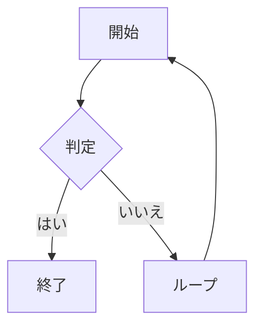

# obsidian-markdown: Obsidian Flavored Markdown

任意の wiki ページを書くときに本スキルを参照する。Obsidian は標準 Markdown を wikilink、埋め込み、callout、プロパティで拡張する。構文を間違えるとリンクが壊れたり callout が見えなくなったり frontmatter が壊れる。

> **言語ルール**: ノートの本文・見出し・callout タイトル・テーブル列・脚注の説明は日本語で書く。frontmatter のキー名と列挙値、wikilink ターゲット、ファイル名、コードブロック内のコードは英語のまま。

**関連リファレンス**: kepano/obsidian-skills プラグインがインストールされていれば、その正規 obsidian-markdown スキルを優先。なければ下のリファレンスを使用。[github.com/kepano/obsidian-skills](https://github.com/kepano/obsidian-skills) も参照。

---

## Wikilink

内部リンクは二重ブラケット。拡張子なしのファイル名。

| 構文 | 動作 |
|---|---|
| `[[Note Name]]` | 基本リンク |
| `[[Note Name\|表示テキスト]]` | エイリアス付きリンク(「表示テキスト」を表示) |
| `[[Note Name#見出し]]` | 特定見出しへのリンク |
| `[[Note Name#^block-id]]` | 特定ブロックへのリンク |

ルール:
- 一部システムでは大文字小文字を区別。正確なファイル名と一致させる。
- パス不要: Obsidian はファイル名の一意性で解決。
- 同名ファイルが 2 つあれば `[[Folder/Note Name]]` で曖昧性解消。
- 日本語ローカライズ版では `aliases:` で日本語表示名を併記。`[[Hot Cache]]` でも `[[ホットキャッシュ]]` でも解決可能になる。

---

## 埋め込み

埋め込みは wikilink の前に `!`。コンテンツがインライン表示される。

| 構文 | 動作 |
|---|---|
| `![[Note Name]]` | ノート全体を埋め込み |
| `![[Note Name#見出し]]` | セクションを埋め込み |
| `![[image.png]]` | 画像埋め込み |
| `![[image.png\|300]]` | 幅 300px で画像埋め込み |
| `![[document.pdf]]` | PDF 埋め込み(Obsidian がネイティブレンダリング) |
| `![[audio.mp3]]` | 音声埋め込み |

---

## Callout

callout はタイプキーワード付きのブロッククォート。スタイル付きアラートボックスとしてレンダリング。

```markdown
> [!note]
> デフォルトの情報 callout。

> [!note] カスタムタイトル
> カスタムタイトル付き callout。

> [!note]- 折りたたみ可能(デフォルト閉じ)
> クリックで展開。

> [!note]+ 折りたたみ可能(デフォルト開き)
> クリックで折りたたむ。
```

### 全 callout タイプ

| タイプ | エイリアス | 用途 |
|------|---------|---------|
| `note` |: | 一般的なメモ |
| `abstract` | `summary`, `tldr` | 要約 |
| `info` |: | 情報 |
| `todo` |: | アクション項目 |
| `tip` | `hint`, `important` | ヒント・強調 |
| `success` | `check`, `done` | ポジティブな結果 |
| `question` | `help`, `faq` | 未解決の問い |
| `warning` | `caution`, `attention` | 警告 |
| `failure` | `fail`, `missing` | エラー・失敗 |
| `danger` | `error` | 重大な問題 |
| `bug` |: | 既知のバグ |
| `example` |: | 例 |
| `quote` | `cite` | 引用 |
| `contradiction` |: | 矛盾する情報(ウィキ規約) |

---

## プロパティ(frontmatter)

Obsidian は YAML frontmatter を Properties パネルとしてレンダリング。ルール:

```yaml
---
type: concept                    # 平文文字列(英語の列挙値)
title: "ノートタイトル(日本語可)"  # 特殊文字を含むなら引用符
aliases: ["English Filename", "日本語表示名"]  # 日本語ローカライズ版で重要
created: 2026-04-08              # 日付は YYYY-MM-DD(ISO 日時ではない)
updated: 2026-04-08
tags:
  - tag-one                      # リスト項目は - 形式
  - tag-two
status: developing               # 列挙値は英語
related:
  - "[[Other Note]]"             # YAML 内の wikilink は引用符必須
sources:
  - "[[source-page]]"
---
```

ルール:
- フラットな YAML のみ。オブジェクトをネストしない。
- 日付は `YYYY-MM-DD`、`2026-04-08T00:00:00` ではない。
- リストは `- item`、インラインの `[a, b, c]` ではない。
- YAML 内の wikilink は引用符必須: `"[[Page]]"`。
- `tags` フィールド: Obsidian はこれをタグリストとして読み、Vault 内で検索可能。
- `aliases:` には英語ファイル名と日本語表示名の両方を含める。

---

## タグ

2 つの有効な形式:

```markdown
#tag-name             : 本文中のインラインタグ
#parent/child-tag     : ネストタグ(タグペインで階層表示)
```

frontmatter 内:
```yaml
tags:
  - research
  - ai/obsidian
```

frontmatter のタグリストでは `#` を使わない。タグ名のみ。

---

## テキスト書式

標準 Markdown + Obsidian 拡張:

| 構文 | 結果 |
|---|---|
| `**太字**` | 太字 |
| `*斜体*` | 斜体 |
| `~~取り消し線~~` | 取り消し線 |
| `==ハイライト==` | ハイライトテキスト(Obsidian で黄) |
| `` `インラインコード` `` | インラインコード |

---

## 数式

Obsidian は MathJax/KaTeX を使用:

インライン数式:
```markdown
$E = mc^2$
```

ブロック数式:
```markdown
$$
\int_0^\infty e^{-x} dx = 1
$$
```

---

## コードブロック

標準のフェンス付きコードブロック。Obsidian は主要言語をハイライト:

````markdown
```python
def hello():
    return "world"
```
````

---

## テーブル

標準 Markdown テーブル:

```markdown
| 列 A | 列 B | 列 C |
|----------|----------|----------|
| 値    | 値    | 値    |
| 値    | 値    | 値    |
```

Obsidian はテーブルをネイティブにレンダリング。プラグイン不要。

---

## Mermaid 図

Obsidian は Mermaid をネイティブにレンダリング:

````markdown

````

サポート: `graph`, `sequenceDiagram`, `gantt`, `classDiagram`, `pie`, `flowchart`。

---

## 脚注

```markdown
この文には脚注が付く。[^1]

[^1]: 脚注テキストはここ。
```

---

## 禁止事項

- 内部リンクに `[link text](path/to/note.md)` を使わない: 代わりに `[[Note Name]]` を使う。
- callout 内で HTML を使わない: Markdown のみ。
- callout 本文内で `##` を使わない: callout 内では見出しがレンダリングされない。
- frontmatter で `tags: [a, b, c]` をインラインで書かない: Obsidian はリスト形式を好む。
- frontmatter で ISO 日時(`2026-04-08T00:00:00Z`)を書かない: `2026-04-08` を使う。
- 本文を英語のままにしない(日本語ローカライズ版): 本文と見出しは日本語で書く。
